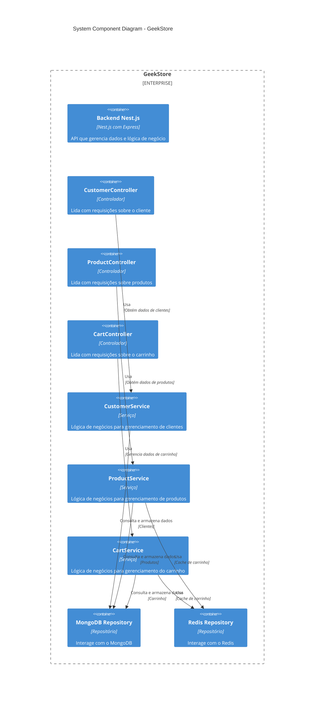

```mermaid
C4Component
title System Component Diagram - GeekStore

Enterprise_Boundary(ecommerce, "GeekStore") {
    Container(Backend, "Backend Nest.js", "Nest.js com Express", "API que gerencia dados e lógica de negócio")
    Container(CustomerController, "CustomerController", "Controlador", "Lida com requisições sobre o cliente")
    Container(ProductController, "ProductController", "Controlador", "Lida com requisições sobre produtos")
    Container(CartController, "CartController", "Controlador", "Lida com requisições sobre o carrinho")
    Container(CustomerService, "CustomerService", "Serviço", "Lógica de negócios para gerenciamento de clientes")
    Container(ProductService, "ProductService", "Serviço", "Lógica de negócios para gerenciamento de produtos")
    Container(CartService, "CartService", "Serviço", "Lógica de negócios para gerenciamento do carrinho")
    Container(MongoDBRepository, "MongoDB Repository", "Repositório", "Interage com o MongoDB")
    Container(RedisRepository, "Redis Repository", "Repositório", "Interage com o Redis")
}

Rel(CustomerController, CustomerService, "Usa", "Obtém dados de clientes")
Rel(ProductController, ProductService, "Usa", "Obtém dados de produtos")
Rel(CartController, CartService, "Usa", "Gerencia dados de carrinho")
Rel(CustomerService, MongoDBRepository, "Consulta e armazena dados", "Clientes")
Rel(ProductService, MongoDBRepository, "Consulta e armazena dados", "Produtos")
Rel(CartService, MongoDBRepository, "Consulta e armazena dados", "Carrinho")
Rel(ProductService, RedisRepository, "Usa", "Cache de carrinho")
Rel(CartService, RedisRepository, "Usa", "Cache de carrinho")
```
