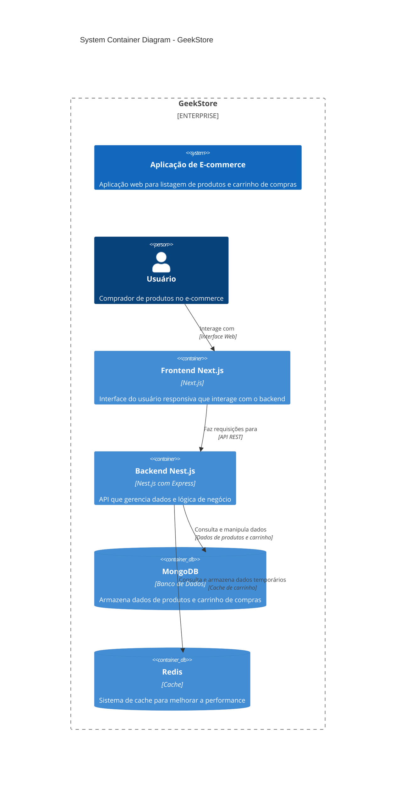

```mermaid
C4Container
  title System Container Diagram - GeekStore
   Enterprise_Boundary(ecommerce, "GeekStore") {
    System(geekstore, "Aplicação de E-commerce", "Aplicação web para listagem de produtos e carrinho de compras")
    Person(usuario, "Usuário", "Comprador de produtos no e-commerce")
    Container(frontend, "Frontend Next.js", "Next.js", "Interface do usuário responsiva que interage com o backend")
    Container(backend, "Backend Nest.js", "Nest.js com Express", "API que gerencia dados e lógica de negócio")
    ContainerDb(mongodb, "MongoDB", "Banco de Dados", "Armazena dados de produtos e carrinho de compras")
    ContainerDb(redis, "Redis", "Cache", "Sistema de cache para melhorar a performance")
  }
  Rel(usuario, frontend, "Interage com", "Interface Web")
  Rel(frontend, backend, "Faz requisições para", "API REST")
  Rel(backend, mongodb, "Consulta e manipula dados", "Dados de produtos e carrinho")
  Rel(backend, redis, "Consulta e armazena dados temporários", "Cache de carrinho")
```
