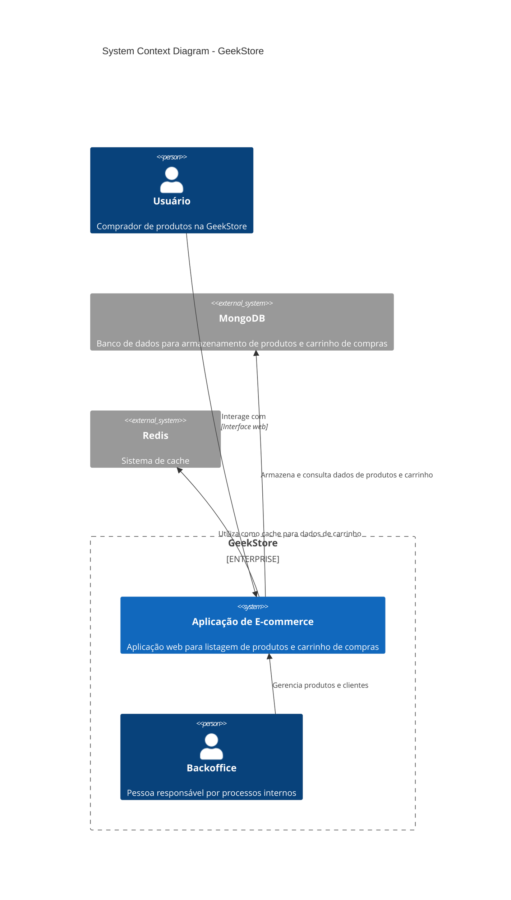

```mermaid
C4Context
  title System Context Diagram - GeekStore
   Enterprise_Boundary(ecommerce, "GeekStore") {
    System(geekstore, "Aplicação de E-commerce", "Aplicação web para listagem de produtos e carrinho de compras")
    Person(backoffice, "Backoffice", "Pessoa responsável por processos internos")
  }
  Person(usuario, "Usuário", "Comprador de produtos na GeekStore")
  System_Ext(mongodb, "MongoDB", "Banco de dados para armazenamento de produtos e carrinho de compras")
  System_Ext(redis, "Redis", "Sistema de cache")
  Rel(backoffice, geekstore, "Gerencia produtos e clientes")
  Rel(usuario, geekstore, "Interage com", "Interface web")
  Rel(geekstore, mongodb, "Armazena e consulta dados de produtos e carrinho")
  Rel(geekstore, redis, "Utiliza como cache para dados de carrinho")
```
